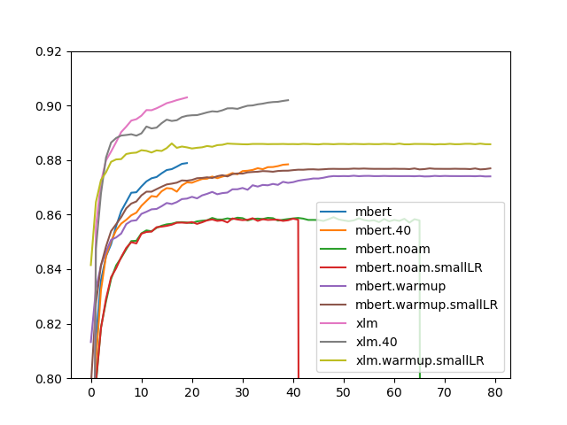

When training on very large amounts of data, especially when it is varied, different hyper-parameters might be optimal. However, they are also more costly to tune. For our MaChAmp toolkit, we were interested in training one model for the whole of UD2.7 (and additional not-officially released UD treebanks). With our default settings, our model achieved an average LAS score over all datasets of 72.82, compared to 72.22 when we trained multiple single treebank parsers. In the original paper ([van der Goot et al.,2021](https://www.aclweb.org/anthology/2021.eacl-demos.22.pdf)), we already improved performance further by smoothing the dataset sizes, where we make the sizes of the datasets more similar: small datasets are upsampled, and large datasets are downsampled (more information can be found in the paper).

To the best of my knowledge, [Udify](https://github.com/Hyperparticle/udify) ([Kondratyk and Straka, 2019](https://www.aclweb.org/anthology/D19-1279.pdf)) was the first attempt to train a single parser on such a wide variety of datasets. Interestingly, they use substantially different hyperparameters as we use in MaChAmp. One major difference is the number of epochs, which is coupled with using a different learning rate (+scheduler). In MaChAmp we use 20 epochs, and a slanted triangular learning rate scheduler with a learning rate of 0.0001, whereas in Udify, they train for 80 epochs, use the ULMFiT scheduler with an inverse square root learning rate decay with linear warmup (Noam). They use a learning rate of 0.001, and suggest to set the warmup equal to the number of batches (number of sentences in train/batch size). In the beginning of the development of MaChAmp, we saw similar performances between our two setups, and decided to use slanted triangular, as it is officially supported by AllenNLP.

However, when training again on so many datasets, we were wondering whether a simpler learning rate scheduler would be better when training for 80 epochs, as very low learning rates in the later part of the training might lead to consistent improvements. We evaluated most of the schedulers available withing AllenNLP with mBERT, and finally compared the most promising settings with XLM-r (because it is more costly to train).

Results are shown in the plot above (x-axis: LAS over all dev-sets, y-axis: epochs), for all results, dataset smoothing was enabled (0.5, as in the MaChAmp paper). The red and green line are cut off because our machine crashed and it did not seem worth it to restart them. We tried our original learning rate (0.0001) as well as a small one (0.00001), motivated by the fact that we have more epochs and more steps (because of the larger datasize) to converge. This is denoted with .smallLR in the figure. We used 16000 warmup steps. The models without noam/warmup in their name use the MaChAmp default (slanted triangular), and clearly outperform the other schedulers. Furthermore, one clear takeaway is that our models trained for 20 epochs are performing equally well as the ones that are trained for 40 or 80 epochs.

Even though this small hyperparameter-tuning is not exhaustive (it is very costly to train these huge models, there are 1,136,897 sentences in the training data), it shows that slanted triangular is a robust learning rate scheduler, and that training for 20 epochs is a (lucky) optimal. I also tried 15 and 10 epochs to check whether the same performance can be gained more efficiently, but this led to substantially lower scores. We release some of our complete models at: [https://github.com/machamp-nlp/machamp/blob/master/docs/models.md](https://github.com/machamp-nlp/machamp/blob/master/docs/models.md)

