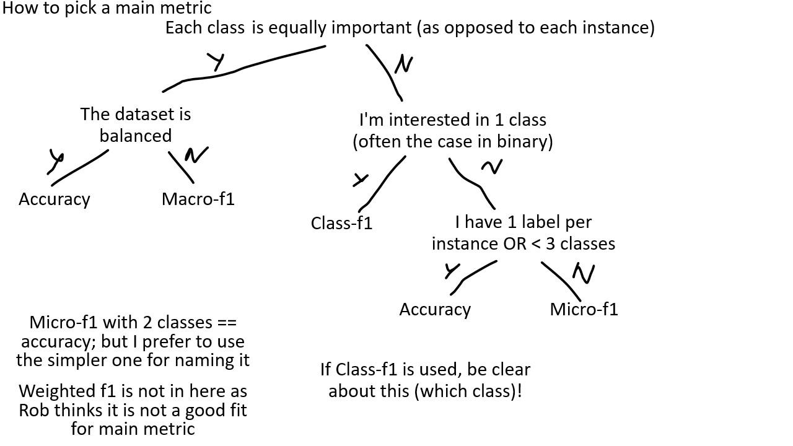

I commonly come accross evaluations where in my opinion the wrong metrics are
used, even in some prominent benchmarks.  This seems to be mainly due to the
misundertanding that for datasets/tasks with unbalanced class-distribution,
macro-F1 is always the correct metric. I disagree with this heuristic. What is
more important is to ask yourself: do I care most about all classes being found
correctly, or do I care more about the number of correct instances.
Furthermore, accuracy has the benefit of being more interpretable, having a
value of 0.66 just means we got 66% of all instances correct, but for F1 this
is less obvious, it could be recall = .6 and precision is .6, but they could
also be .5 and 1.0. Of course, we do need to include the majority baseline for
interpretation of accuracy.  Another strange combination I see too often is a
binary task with macro-F1; it should be noted here that an error for class A is
automatically also an error in class B (an FP for A becomes a FN for B), which
is probably not desired (note that SKLearn gives a warning for this).

After discussing with some of my collegues (mostly
[Elisa](https://elisabassignana.github.io/) and
[Christian](https://christianhardmeier.rax.ch/)), and mostly agreeing to
disagree, I have came up with a decision tree (shown below). It should be noted
that this is subjective (if I didn't make this clear enough yet).

